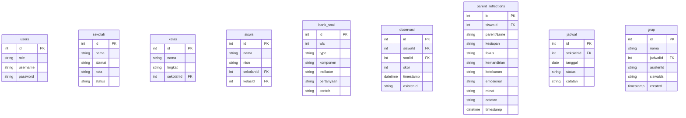

# 📝 Product Requirement Document (PRD) - WLC App (v1.1)

## 1. Pendahuluan & Latar Belakang
**WLC App** adalah platform berbasis web (Single Page Application) yang dirancang untuk mendokumentasikan, memantau, dan melaporkan perkembangan belajar siswa Kumon melalui observasi berkala. Tagline utama aplikasi ini adalah *"WLC: Pendampingan, bukan penilaian."* 

Aplikasi ini memfasilitasi pencatatan perkembangan siswa secara holistik, baik dari sudut pandang asisten/evaluator di kelas maupun melalui refleksi langsung oleh orang tua siswa (*parent reflection*).

---

## 2. Tujuan & Sasaran (Goals)
* **Digitalisasi Observasi**: Menggantikan formulir kertas observasi menjadi sistem input berbasis web.
* **Kolaborasi Tiga Arah**: Menghubungkan Owner, Asisten/Evaluator, dan Orang Tua untuk memantau kemajuan belajar siswa.
* **Laporan Premium**: Menghasilkan sertifikat atau lembar *snapshot* perkembangan format **A4 Landscape** dengan standar layout desain DKV profesional yang siap cetak atau dibagikan ke orang tua.
* **Offline-Ready & Ringan**: Menggunakan arsitektur Single Page Application (SPA) berbasis HTML/JS vanilla dengan backend PHP ringan dan SQLite, memudahkan penyebaran di hosting murah (cPanel) maupun dijalankan secara lokal di laptop unit Kumon.

---

## 3. Peran Pengguna & Hak Akses (User Roles)

Aplikasi memiliki tiga peran utama dengan batasan akses sebagai berikut:

| Fitur / Modul | Owner | Evaluator | Asisten | Orang Tua (Public) |
| :--- | :---: | :---: | :---: | :---: |
| **Dashboard Utama (Statistik)** | Ya (Penuh) | Ya | Ya (Terbatas) | Tidak |
| **Manajemen Sekolah & Kelas** | Ya (Penuh) | Lihat Saja | Lihat Saja | Tidak |
| **Manajemen Siswa** | Ya (Penuh) | Ya | Ya | Tidak |
| **Manajemen Komponen Observasi** | Ya (Penuh) | Lihat Saja | Lihat Saja | Tidak |
| **Penjadwalan & Grup Belajar** | Ya (Penuh) | Ya | Ya | Tidak |
| **Input Skor Observasi** | Ya | Ya | Ya | Tidak |
| **Cetak Sertifikat / Snapshot** | Ya | Ya | Ya | Tidak |
| **Pengisian Refleksi Orang Tua** | Ya | Tidak | Tidak | Ya (Link Khusus) |
| **Manajemen Pengguna & Pengaturan** | Ya (Penuh) | Tidak | Tidak | Tidak |

---

## 4. Arsitektur & Struktur Data (Database Schema)
Aplikasi menggunakan database relational **SQLite** (`wlc.db`) dengan relasi tabel sebagai berikut:

### Penjelasan Detil Kolom Tambahan:
* **`bank_soal` (Komponen Observasi)**: "Bank WLC" diubah namanya menjadi Komponen Observasi untuk merefleksikan proses pendampingan daripada ujian. Kolom `wlc` merepresentasikan tingkatan atau modul kuesioner.
* **`parent_reflections`**: Menampung data umpan balik dari orang tua terkait aspek kesiapan, fokus, kemandirian, ketekunan, emosional, dan minat belajar anak di rumah.

---

## 5. Fitur Utama & Kebutuhan Fungsional

### 5.1. Autentikasi Keamanan (Security & Auth)
* Menggunakan token berbasis JWT (JSON Web Token) dengan kunci rahasia dinamis yang disimpan di `.jwt_secret`.
* Token kedaluwarsa setelah 24 jam.
* Penyimpanan password didekripsi/enkripsi menggunakan `PASSWORD_BCRYPT`.

### 5.2. Dashboard & Statistik
* Menampilkan ringkasan total siswa, sekolah yang terdaftar, dan jadwal mendatang.
* Visualisasi grafik perkembangan siswa berdasarkan rata-rata skor observasi.

### 5.3. Modul Manajemen Entitas (CRUD)
* **Sekolah**: Tambah, edit, dan verifikasi status sekolah (`acc` atau `pending`).
* **Kelas**: Dropdown relasional yang tersaring otomatis berdasarkan sekolah terpilih.
* **Siswa**: Validasi NISN unik dengan relasi sekolah dan kelas.
* **Komponen Observasi**: Import otomatis data bank soal dari `bank_soal_wlc1.json` jika database kosong.

### 5.4. Laporan Perkembangan & Sertifikat
* Pencetakan laporan perkembangan langsung dari web browser.
* Desain layout **A4 Landscape** yang disempurnakan (Expert DKV Layout).
* Parameter cetak otomatis menyembunyikan navigasi header/footer agar hasil cetak bersih.

### 5.5. Refleksi Orang Tua (Parent Reflection)
* Disediakan halaman terpisah (`reflection.html`) yang dapat diakses tanpa login oleh orang tua.
* Orang tua mengisi formulir penilaian mandiri terhadap perilaku belajar anak di rumah. Data terhubung langsung ke ID siswa menggunakan tautan rujukan.

---

## 6. Kebutuhan Antarmuka Pengguna (UI/UX)
* **Desain Premium & Modern**: Warna bertema alam/daun hijau (`🌿 WLC`) dengan paduan gelap-terang yang lembut (soft shadows, glassmorphic card).
* **Modal Fixed Center**: Pengeditan dan penambahan entitas menggunakan modal melayang di tengah layar (fixed center) untuk kemudahan navigasi daripada memanjang ke bawah.
* **Responsif**: Layout fleksibel untuk desktop maupun tablet yang biasa dibawa oleh asisten di ruang kelas.

---

## 7. Rencana Rilis & Deployment (Hosting)
* **Backend target**: PHP v8.1/8.2 dengan ekstensi `pdo_sqlite` dan `sqlite3` aktif.
* **Server**: cPanel hosting IDWebHost di subdomain `wlc.kumonwahidincilacap.com`.
* **Prosedur Upload**: File dikemas dalam ZIP (`index.html`, `api.php`, `.htaccess`, `manifest.json`, `bank_soal_wlc1.json`) lalu diekstrak di folder subdomain public_html.
